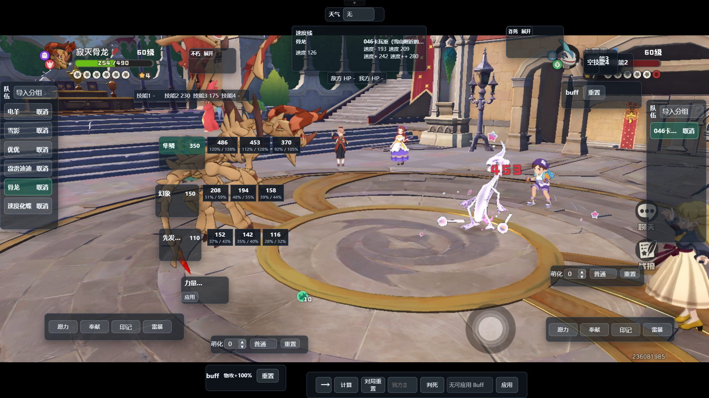
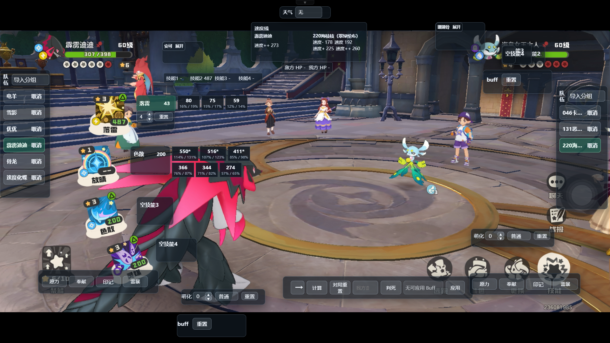
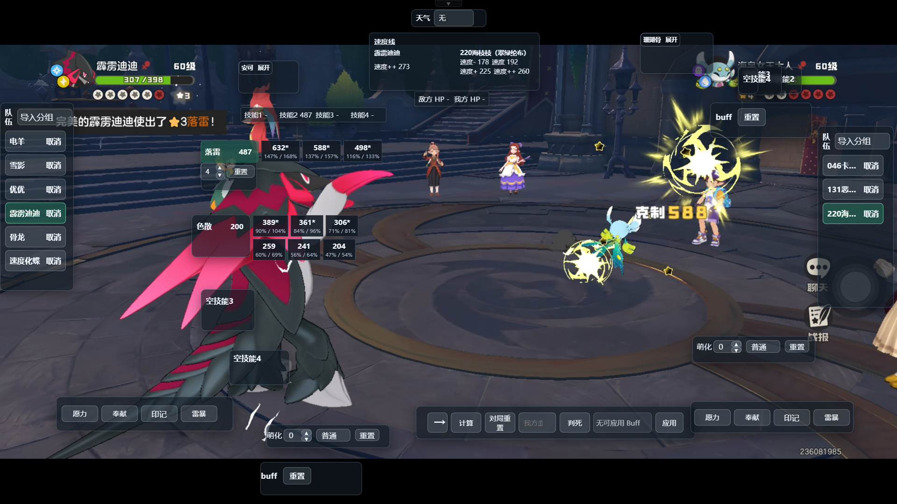
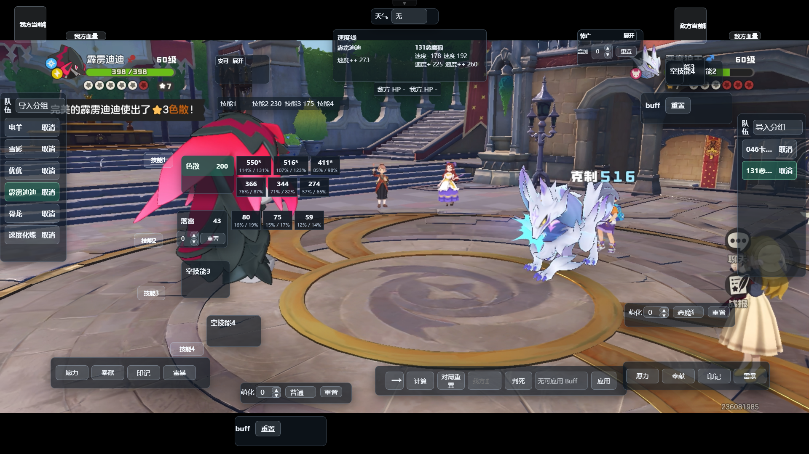

# 项目介绍
这是一个用于洛克王国世界 PVP 的伤害计算器。

支持保存完整阵容信息，并模拟游戏中的技能、特性、天气等战斗机制。

目前已经同步至S4版本
## 技术架构

- Tauri：桌面应用容器
- Rust：应用原生能力与前后端通信
- Python：核心计算与数据处理

## 目录
- [简单使用](#简单使用)
- [插件模式](#插件模式)
  - [获取窗口id](#获取窗口ID)
  - [校对窗口](#校对窗口)
  - [效果截图](#效果截图)
- [使用说明](#使用说明)
- [项目功能](#项目功能)
  - [计算](#计算)
  - [阵容保存](#阵容保存)
  - [战斗相关特性](#战斗相关特性)
  - [技能触发情况](#技能触发情况)
  - [首领化和萌化](#首领化和萌化)
  - [Buff 类技能快速叠加](#buff-类技能快速叠加)
  - [其他功能](#其他功能)
    - [天气](#天气)
    - [奉献](#奉献)
    - [雷暴](#雷暴)
    - [印记](#印记)
- [下载](#下载)
- [界面展示](#界面展示)
  - [主界面](#主界面)
  - [计算结果](#计算结果)
  - [队伍保存](#队伍保存)
- [数据来源](#数据来源)
- [已知问题](#已知问题)
- [后续计划](#后续计划)
- [致谢](#致谢)

## 简单使用
- 选择己方精灵，选择己方精灵技能。选择敌方精灵。
- 根据实际情况设置天分，性格，特性, 天气, 印记, buff等状态。
- 对于需要手动触发的特性，根据实际战斗情况点击对应按钮。
- 点击计算查看结果。
- 了解后可以使用队伍保存功能

## 插件模式
- 特别说明: 未完善， 没有优化界面
- 需要获取并绑定游戏窗口，本项目不读取任何游戏文件。采用视频起到的效果是一样的
- 点击**混合模式**进入游戏和插件混合交互状态
- F8 编辑模式，可以回到插件 
- F9收缩（目前无效果）
- ctrl+j 快速计算，结果简单的出现在技能的右侧
- 伤害说明:
  - 在攻击方指定天分和性格的情况下，计算会出现三个伤害，代表着防御方的"防御+"，"防御"，"防御-"
  - 在每个伤害对应两个百分比血量"生命++"和"生命+"，百分比向下取整，游戏内的百分比是向上取整的，所以如果计算百分比大于当前血量百分比，一定可以击杀
- ctrl+b 战斗开始识别，可用于战斗开始快捷导入敌方阵容（目前样本不够，不准确）
- ctrl+u 战斗内识别（识别血量和双方精灵，会自动切换双方精灵。目前样本不够，不准确）
- ctrl+p 校准威力（识别技能威力，对应位置的技能有叠层还会自动修正叠层，目前的模式不支持传动）

### 获取窗口ID

使用 PowerShell 命令获取窗口 ID（`MainWindowHandle` 下的数字）。

需要注意的是，会有两个窗口：一个是启动器窗口，另一个才是游戏窗口。

```powershell
Get-Process | Where-Object {$_.MainWindowTitle -like "*洛克王国*"} | Select-Object Id, ProcessName, MainWindowTitle, MainWindowHandle
```

### 校对窗口
- 有两类战斗相关窗口：
  - **战斗内框**：包含 4 个技能框、2 个角色图像框和 2 个血量框，用于识别战斗中的双方状态。
  - **战斗开始框**：包含 6 个敌方图像框，用于识别战斗开始时的敌方队伍。

- 如图所示。所有图像框建议将底部边栏放置在对应图像的正下方，并与图像保持少量间距。
 

 

### 效果截图
图片素材来自本人录制的视频，**非实时**演示。目前项目不完善，还需要改进

可以看到造成的伤害是隼麟的第二项，453


这里只有**技能2**显示威力的原因是我没有重新导入数据，所以技能识别的位置是第二个技能。由于这是手机录的，这里的识别位置不正确，其他技能也没有正确识别威力
 

 

这里的色散的计算结果中用*表明的就是技能的触发情况
 

## 项目功能

### 计算
- 支持常规计算，对于敌方天分无的情况会有一个预设来决定敌方天分和性格（预设为防御+， 防御，防御-.生命++，生命+，生命）
- 计算结果中"++"代表性格和天分双加成，"+"代表只有天分，"-"代表性格减益。 一般不会出现防御性格增益也不会出现生命减益，故默认防御没有++，生命没有-

### 阵容保存
- 保存技能,精灵，天分内容。可直接输入游戏内完整阵容码来进行快捷导入。
- 强烈建议保存自己的阵容所有数值，否则计算结果界面会有很多数值结果
- 可在队伍面板中直接导入以保存阵容

### 战斗相关特性
- 实现绝大部分的战斗相关特性
- 如特殊条件类，如星光狮，鸭吉吉（需要点击触发按钮）
- 部分特性为被动（如泥吼呀，独角兽），会自动结算
- 叠层特性可以手动输入层数
- 保存界面可以指定是否默认触发（针对巨噬针鼹），首领化，以及叠加层数（针对蜂后）

### 技能触发情况
- 特殊触发技能的计算结果中会带有两种情况的展示，触发情况和基础情况
- 可叠层特性需要自己输入层数（如果不知道自己叠了几层，可以点击计算结果来看威力和游戏内是否一致）

### 首领化和萌化
- 首领化针对棋绮后做了特殊处理，不会替换原本的特性

### buff类技能快速叠加
- 如嘲弄等叠buff技能可以直接快速应用，会给相应目标对应的buff(目前标签不完善)

### 其他功能
#### 天气
- 目前只有雨天对战斗有影响

#### 奉献
- 目前有奉献的威力增加+以及连击加成

#### 雷暴
- 雷暴面板中有选用的技能，选择后代表雷暴目前已经记录这个技能
- 战斗中，如果电流刺激特性触发并且（星光狮特性）没有记录在雷暴面板，两次雷暴（面板中有电流脉冲）伤害会不一致，这点和游戏一致

#### 印记
- 给敌方设置星陨印记层数在引爆时会自动星陨印记的伤害（目前伤害未分离）
- 对应的支持蓄势印记，蓄电印记（需要手动点击触发），攻击印记


## 下载
[下载 Windows 安装程序](https://github.com/180sans/roco-cal/releases)
下载后直接安装即可。

> 注意：由于当前版本尚未进行代码签名，Windows SmartScreen 可能提示“Windows 已保护你的电脑”，安装程序也可能显示为“未认证”。

## 界面展示


### 主界面

计算左边的箭头代表攻击方向，应用代表应用buff\
\


### 计算结果
常规计算结果，表格中左上角代表着攻击方精灵的攻击属性（如下图中的魔攻++和魔攻+），表格的防御和生命属性代表受击方的属性，生命占比为向下取整（目前了解敌方精灵显示血量%是向上取整的）\
\
\
技能的触发情况\
\
\

### 队伍保存


## 数据来源
- 计算公式系数来源于 [b站up主血羽纷落](https://space.bilibili.com/329859964)
- 精灵数据来源于 [b站洛克王国世界wiki](https://wiki.biligame.com/rocom)

## 已知问题
- 黑（白）加尔特性没有实现
- 配置界面的说明不完善，处于测试状态

## 后续计划
- 针对这类多次行动的技能实现（如吹火，乘胜追击等第二次结果和第一次不一致的情况），目前实现部分
- 完善部分尚未实现的特性。
- 完善 Buff 标签显示。
- 暂不考虑加入技能、精灵等图标。
- 收集精灵图片用于训练（我发现识别不准确是一件让人非常火大的事情。正常情况自己在战斗，本来就紧张，还需要手工调整来维护数据是很恼火的），将做为后续的重点，界面优化稍微往后放放
- 加入阵容码导入阵容（自己手动导入阵容也是一个令人烦躁的点）

## 致谢
- [Linux Do](https://linux.do) — 感谢社区提供的交流平台。