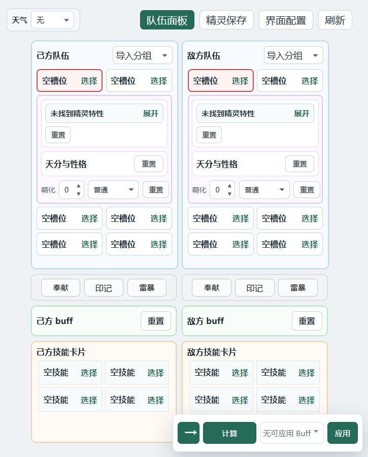
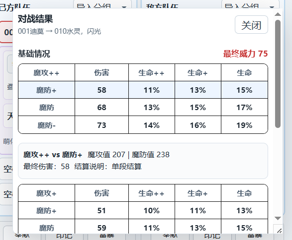
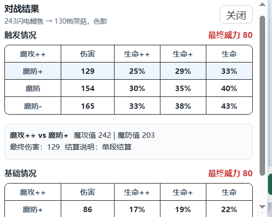
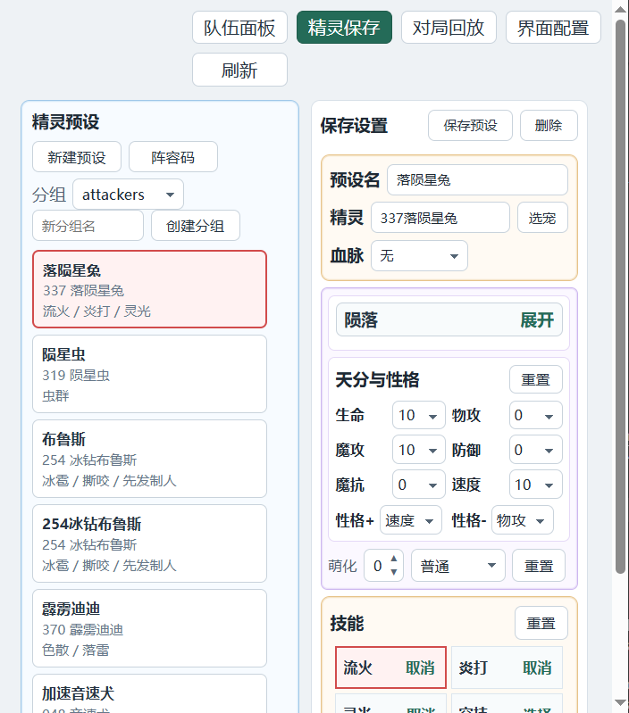

# 项目介绍
这是一个用于洛克王国世界 PVP 的伤害计算器。

支持保存完整阵容信息，并模拟游戏中的技能、特性、天气等战斗机制。

## 目录
- [使用说明](#使用说明)
- [项目功能](#项目功能)
  - [计算](#计算)
  - [阵容保存](#阵容保存)
  - [战斗相关特性](#战斗相关特性)
  - [技能触发情况](#技能触发情况)
  - [首领化和萌化](#首领化和萌化)
  - [Buff 类技能快速叠加](#buff-类技能快速叠加)
  - [其他功能](#其他功能)
    - [天气](#天气)
    - [奉献](#奉献)
    - [雷暴](#雷暴)
    - [印记](#印记)
- [下载](#下载)
- [界面展示](#界面展示)
  - [主界面](#主界面)
  - [计算结果](#计算结果)
  - [队伍保存](#队伍保存)
- [数据来源](#数据来源)
- [已知问题](#已知问题)
- [后续计划](#后续计划)
- [致谢](#致谢)

## 简单使用
- 选择己方精灵，选择己方精灵技能。选择敌方精灵。
- 根据实际情况设置天分，性格，特性, 天气, 印记, buff等状态。
- 对于需要手动触发的特性，根据实际战斗情况点击对应按钮。
- 点击计算查看结果。
- 了解后可以使用队伍保存功能

## 项目功能

### 计算
- 支持常规计算，对于敌方天分性格无的情况会有一个预设来决定敌方天分和性格
- 计算结果中"++"代表性格和天分双加成，"+"代表只有天分，"-"代表性格减益。 一般不会出现防御性格增益，故默认防御没有++

### 阵容保存
- 可保存技能,精灵，天分等内容
- 强烈建议保存自己的阵容所有数值，否则计算结果界面会有很多数值结果
- 可在队伍面板中直接导入以保存阵容

### 战斗相关特性
- 实现绝大部分的战斗相关特性
- 如特殊条件类，如星光狮，鸭吉吉（需要点击触发按钮）
- 部分特性为被动（如泥吼呀，独角兽），会自动结算
- 叠层特性可以手动输入层数
- 保存界面可以指定是否默认触发（针对巨噬针鼹），首领化，以及叠加层数（针对蜂后）

### 技能触发情况
- 特殊触发技能的计算结果中会带有两种情况的展示，触发情况和基础情况
- 可叠层特性需要自己输入层数（如果不知道自己叠了几层，可以点击计算结果来看威力和游戏内是否一致）

### 首领化和萌化
- 首领化针对棋绮后做了特殊处理，不会替换原本的特性

### buff类技能快速叠加
- 如嘲弄等叠buff技能可以直接快速应用，会给相应目标对应的buff(目前标签不完善)

### 其他功能
#### 天气
- 目前只有雨天对战斗有影响

#### 奉献
- 目前有奉献的增伤以及连击加成

#### 雷暴
- 雷暴面板中有选用的技能，选择后代表雷暴目前已经记录这个技能
- 战斗中，如果电流刺激特性触发并且（星光狮特性）没有记录在雷暴面板，两次雷暴（面板中有电流脉冲）伤害会不一致，这点和游戏一致

#### 印记
- 给敌方设置星陨印记层数在引爆时会自动星陨印记的伤害（目前伤害未分离）
- 对应的支持蓄势印记，蓄电印记（需要手动点击触发），攻击印记

## 下载
[下载 Windows 安装程序](https://github.com/180sans/roco-cal/releases/download/v0.1.0/Roco.Datacal_0.1.0_x64-setup.exe)
下载后直接安装即可。

> 注意：由于当前版本尚未进行代码签名，Windows SmartScreen 可能提示“Windows 已保护你的电脑”，安装程序也可能显示为“未认证”。

## 界面展示

### 主界面

计算左边的箭头代表攻击方向，应用代表应用buff
### 计算结果
常规计算结果\
\
技能的触发情况\
\

### 队伍保存

## 数据来源
- 计算公式系数来源于 b站up主 血羽纷落 https://space.bilibili.com/329859964
- 精灵数据来源于 b站洛克王国世界wiki https://wiki.biligame.com/rocom

## 已知问题
- 记忆石特性目前处于常态触发状态
- 黑（白）加尔特性没有实现
- 库拉的首领化没有加入
- 配置界面的说明不完善，处于测试状态

## 后续计划
- 针对这类多次行动的技能实现（如吹火，乘胜追击等第二次结果和第一次不一致的情况），目前实现部分
- 完善部分尚未实现的特性。
- 完善 Buff 标签显示。
- 暂不考虑加入技能、精灵等图标。

## 致谢
- https://linux.do — 感谢社区提供的交流平台。